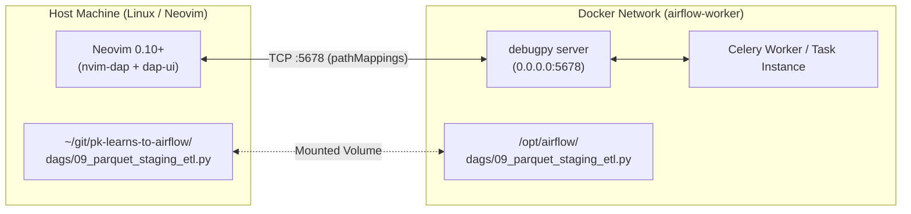

# 🐞 Neovim Python Debugger Setup for Apache Airflow (`NEOVIM-SETUP.md`)

> **Comprehensive guide on debugging Airflow DAGs live as they execute inside Docker containers using Neovim, `nvim-dap`, and `debugpy`.**

---

## 📑 Table of Contents

- [1. Architecture Overview](#1-architecture-overview)
- [2. Installed Plugins & Neovim Configuration](#2-installed-plugins--neovim-configuration)
- [3. DAP Keybindings Reference](#3-dap-keybindings-reference)
- [4. Reusable Debug Helper (`debug_utils.py`)](#4-reusable-debug-helper-debug_utilspy)
- [5. Step-by-Step Live Debugging Walkthrough](#5-step-by-step-live-debugging-walkthrough)
- [6. Docker & Network Port Configuration](#6-docker--network-port-configuration)
- [7. Troubleshooting & FAQs](#7-troubleshooting--faqs)

---

## 1. Architecture Overview

When an Airflow DAG runs inside a Docker container (e.g. `airflow-worker`), it executes in an isolated Linux environment. To debug it from Neovim on your host machine, **`debugpy`** runs a lightweight debug server inside the container, listening on port `5678`. Neovim connects over TCP to inspect execution, pause on breakpoints, and evaluate expressions:



### Why `pathMappings` is Crucial
Airflow workers execute files at `/opt/airflow/dags/...`, but your Neovim buffer opens files at `/home/pkshrestha/git/pk-learns-to-airflow/dags/...`.  
The `pathMappings` configuration in Neovim translates container line numbers to your host buffer seamlessly, ensuring your breakpoints hit exactly where you set them.

---

## 2. Installed Plugins & Neovim Configuration

The following plugins have been installed and configured in your Neovim configuration:

* **`mfussenegger/nvim-dap`**: Core Debug Adapter Protocol client for Neovim.
* **`rcarriga/nvim-dap-ui`**: High-productivity debugging interface (scopes, variable watches, stack traces, breakpoints).
* **`theHamsta/nvim-dap-virtual-text`**: Displays variable values inline alongside your code lines.
* **`mfussenegger/nvim-dap-python`**: Python debug adapter integration for `debugpy`.

### Neovim Configuration File
Located at `~/.config/nvim/lua/plugins/dap.lua`:

```lua
return {
  {
    "mfussenegger/nvim-dap",
    opts = function()
      local dap = require("dap")

      -- Configure Python adapter supporting remote debugpy server
      dap.adapters.python = function(cb, config)
        if config.request == "attach" then
          local port = (config.connect or config).port or 5678
          local host = (config.connect or config).host or "127.0.0.1"
          cb({
            type = "server",
            port = assert(port, "`connect.port` is required for a python `attach` configuration"),
            host = host,
            options = { source_filetype = "python" },
          })
        else
          cb({
            type = "executable",
            command = "python3",
            args = { "-m", "debugpy.adapter" },
            options = { source_filetype = "python" },
          })
        end
      end

      dap.configurations.python = dap.configurations.python or {}

      -- Register Airflow Docker attach profile
      table.insert(dap.configurations.python, 1, {
        type = "python",
        request = "attach",
        name = "Airflow: Attach to Docker (Port 5678)",
        connect = {
          host = "127.0.0.1",
          port = 5678,
        },
        pathMappings = {
          {
            localRoot = function()
              return vim.fn.expand("~/git/pk-learns-to-airflow")
            end,
            remoteRoot = "/opt/airflow",
          },
        },
        justMyCode = false,
      })
    end,
  },
}
```

---

## 3. DAP Keybindings Reference

These standard LazyVim / DAP keybindings are ready to use in Neovim:

| Keybinding | Command | Description |
| :--- | :--- | :--- |
| `<leader>db` | `:DapToggleBreakpoint` | Toggle breakpoint on current line |
| `<leader>dB` | Set conditional breakpoint | Set breakpoint that triggers only on a condition |
| `<leader>dc` | `:DapContinue` | Start debugging or attach to Docker |
| `<leader>dO` / `<F10>` | `:DapStepOver` | Step over next line |
| `<leader>di` / `<F11>` | `:DapStepInto` | Step into function / method |
| `<leader>do` / `<F12>` | `:DapStepOut` | Step out of current function |
| `<leader>du` | `:DapUiToggle` | Toggle the DAP visual UI panels |
| `<leader>dr` | `:DapToggleRepl` | Open interactive Python REPL to eval variables |
| `<leader>dt` | `:DapTerminate` | Terminate active debugging session |

---

## 4. Reusable Debug Helper (`debug_utils.py`)

A helper module is available at [`dags/debug_utils.py`](file:///home/pkshrestha/git/pk-learns-to-airflow/dags/debug_utils.py):

```python
from debug_utils import attach_neovim_debugger

@task
def my_airflow_task():
    # Only pauses and listens if AIRFLOW_DEBUG=true (or force=True)
    attach_neovim_debugger()
    ...
```

### How it behaves:
1. When `AIRFLOW_DEBUG=true` is set, `attach_neovim_debugger()` starts `debugpy` on `0.0.0.0:5678` and pauses task execution until you attach from Neovim.
2. In regular production runs (when `AIRFLOW_DEBUG` is not set), it immediately no-ops with zero overhead.

---

## 5. Step-by-Step Live Debugging Walkthrough

### Example: Debugging `09_parquet_staging_etl.py`

#### 1. Open the DAG in Neovim & Set a Breakpoint
Open the DAG file on your host:
```bash
nvim dags/09_parquet_staging_etl.py
```
Navigate to line 170 (inside `transform_and_enrich_parquet`) and press:
```
<leader>db
```
A breakpoint indicator (🔴 or `B`) will appear on that line.

#### 2. Start the Task in Debug Mode
In a separate terminal, run the task with `AIRFLOW_DEBUG=true`:

```bash
docker compose exec -e AIRFLOW_DEBUG=true airflow-worker airflow tasks test 09_parquet_staging_etl transform_and_enrich_parquet 2026-10-09
```

You will see output in the terminal:
```text
==============================================================
🛑 [Neovim DAP] Debugger listening on 0.0.0.0:5678
   1. Open DAG in Neovim and toggle breakpoints (<leader>db)
   2. Press <leader>dc and select 'Airflow: Attach to Docker'
==============================================================
⏳ [Neovim DAP] Execution paused. Waiting for Neovim to attach...
```

#### 3. Attach Neovim
In your Neovim window:
1. Press `<leader>dc`.
2. A prompt will appear: select **`Airflow: Attach to Docker (Port 5678)`**.
3. Neovim will instantly connect, open the `dap-ui` split panels, and halt at your breakpoint!

#### 4. Inspect & Step Through
* Press `<leader>dO` to step over lines.
* Look at the left split to inspect Pandas DataFrames, row counts, and variable values.
* Press `<leader>dr` to open the REPL and test Python commands live inside the container.
* Press `<leader>dc` to let the task continue to completion.

---

## 6. Docker & Network Port Configuration

Port `5678:5678` is mapped in [docker-compose.yaml](file:///home/pkshrestha/git/pk-learns-to-airflow/docker-compose.yaml#L125-L135):

```yaml
  airflow-worker:
    <<: *airflow-common
    container_name: airflow-worker
    command: celery worker -H worker@%h
    ports:
      - "5678:5678"
```

And `debugpy>=1.8.0` is pinned in [requirements.txt](file:///home/pkshrestha/git/pk-learns-to-airflow/requirements.txt) and [pyproject.toml](file:///home/pkshrestha/git/pk-learns-to-airflow/pyproject.toml).

---

## 7. Troubleshooting & FAQs

### Q: Neovim says `Connection refused` on port 5678
* **Cause:** The Airflow task has not reached `attach_neovim_debugger()` yet, or `airflow-worker` container is not running.
* **Fix:** Ensure `AIRFLOW_DEBUG=true` is exported when running the task, and wait until the task logs output `Debugger listening on 0.0.0.0:5678` before pressing `<leader>dc`.

### Q: Breakpoint is skipped or marked unverified
* **Cause:** File path mismatch between host and container.
* **Fix:** The `pathMappings` in `~/.config/nvim/lua/plugins/dap.lua` maps `~/git/pk-learns-to-airflow` to `/opt/airflow`. Ensure you opened Neovim from within `~/git/pk-learns-to-airflow`.
