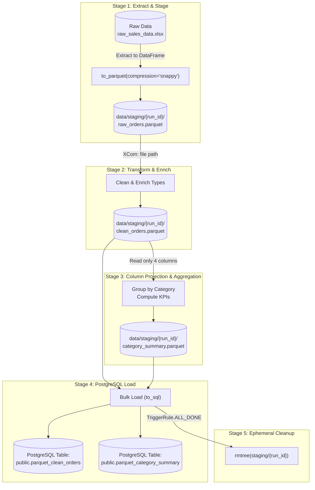

# 🐘 Parquet Staging to PostgreSQL ETL Specification (`PARQUET_POSTGRES_SPEC.md`)

> **Engineering specification and operational reference for DAG `09_parquet_staging_etl`.**  
> Demonstrates high-performance intermediate data staging using Apache Parquet and atomic loading into PostgreSQL.

---

## 📑 Table of Contents

- [1. Architecture Overview](#1-architecture-overview)
- [2. Why Parquet for Internal Processing?](#2-why-parquet-for-internal-processing)
- [3. Pipeline Stages & Data Contracts](#3-pipeline-stages--data-contracts)
- [4. PostgreSQL Schema Specifications](#4-postgresql-schema-specifications)
- [5. How to Trigger & Monitor the DAG](#5-how-to-trigger--monitor-the-dag)
- [6. Verifying Data in PostgreSQL](#6-verifying-data-in-postgresql)
- [7. Operational & Failure Resilience](#7-operational--failure-resilience)

---

## 1. Architecture Overview



---

## 2. Why Parquet for Internal Processing?

Passing large datasets through Airflow's native TaskFlow return values (XCom) is a known anti-pattern:
* **The Problem with Raw XCom:** Airflow stores XCom values directly inside the metadata database (`postgres.public.xcom`). Serializing 100,000+ dictionaries into JSON strains database connection pools, inflates database backup sizes, and can crash the Airflow scheduler.
* **The Parquet Solution:**
  1. **Minimal XCom Footprint:** Tasks pass only a lightweight string file path (e.g. `"/opt/airflow/data/staging/manual__2026-10-09/raw_orders.parquet"`).
  2. **Type Safety:** Column types (dates, timestamps, int64, float64, booleans) are preserved natively in binary format without text re-parsing.
  3. **Column Projection:** Downstream aggregations load only the required columns into RAM (`pd.read_parquet(..., columns=['category', 'net_revenue'])`), reducing worker memory pressure by up to 80%.
  4. **High Compression:** Snappy/ZSTD compression reduces staging disk utilization by 70–90% compared to JSON or CSV.

---

## 3. Pipeline Stages & Data Contracts

| Task ID | Inputs | Outputs | Purpose |
| :--- | :--- | :--- | :--- |
| `extract_and_stage_parquet` | `data/raw_sales_data.xlsx` | `raw_orders.parquet` + Metadata Dict | Extracts raw data and writes run-scoped Parquet file. |
| `transform_and_enrich_parquet` | `raw_orders.parquet` | `clean_orders.parquet` | Cleans currencies, standardizes categories, calculates revenue metrics. |
| `aggregate_category_kpis` | `clean_orders.parquet` | `category_summary.parquet` | Reads projected columns and aggregates category revenue, units, and average order value. |
| `load_to_postgres` | `clean_orders.parquet` & `category_summary.parquet` | PostgreSQL Tables | Loads dataframes into PostgreSQL and executes verification queries. |
| `cleanup_staging_files` | `staged_meta` | Purged staging directory | Runs with `TriggerRule.ALL_DONE` to reclaim staging disk space. |

---

## 4. PostgreSQL Schema Specifications

### Table 1: `public.parquet_clean_orders`

| Column | Type | Description |
| :--- | :--- | :--- |
| `order_id` | `VARCHAR` | Unique order identifier (e.g. `ORD-1001`) |
| `customer_id` | `VARCHAR` | Customer identifier (e.g. `CUST-01`) |
| `category` | `VARCHAR` | Title-cased category (e.g. `Electronics`) |
| `item_desc` | `TEXT` | Item product description |
| `units` | `INTEGER` | Quantity of items sold ($> 0$) |
| `unit_price` | `NUMERIC(10,2)` | Cleaned price per unit |
| `discount_rate` | `NUMERIC(5,4)` | Discount fraction (e.g. $0.10$ for $10\%$) |
| `gross_revenue` | `NUMERIC(12,2)` | $\text{units} \times \text{unit\_price}$ |
| `discount_amount` | `NUMERIC(12,2)` | $\text{gross\_revenue} \times \text{discount\_rate}$ |
| `net_revenue` | `NUMERIC(12,2)` | $\text{gross\_revenue} - \text{discount\_amount}$ |
| `processed_at` | `TIMESTAMP` | UTC timestamp of ETL transformation |

### Table 2: `public.parquet_category_summary`

| Column | Type | Description |
| :--- | :--- | :--- |
| `category` | `VARCHAR` | Product category |
| `total_orders` | `INTEGER` | Number of distinct orders in category |
| `total_units` | `INTEGER` | Total quantity sold |
| `total_gross_rev` | `NUMERIC(14,2)` | Aggregate gross revenue |
| `total_net_rev` | `NUMERIC(14,2)` | Aggregate net revenue |
| `avg_order_value` | `NUMERIC(10,2)` | $\text{total\_net\_rev} / \text{total\_orders}$ |
| `aggregated_at` | `TIMESTAMP` | UTC timestamp of aggregation |

---

## 5. How to Trigger & Monitor the DAG

### Option A: Using the Host Wrapper (`./airflow`)
```bash
# 1. Unpause the DAG
./airflow dags unpause 09_parquet_staging_etl

# 2. Trigger an immediate execution
./airflow dags trigger 09_parquet_staging_etl

# 3. Check latest execution status
./airflow dags list-runs -d 09_parquet_staging_etl --state all
```

### Option B: Via Airflow Web UI
1. Navigate to **[http://localhost:8080](http://localhost:8080)** (`admin` / `admin`).
2. Search for `09_parquet_staging_etl` in the DAG list.
3. Toggle the DAG switch to **Active**.
4. Click the **Play button** (▶) in the top-right corner $\rightarrow$ **Trigger DAG**.
5. Switch to **Graph View** or **Grid View** to watch task states update in real time.

### Option C: Testing Tasks Without Waiting for Scheduler
```bash
# Test extract and staging task
./airflow tasks test 09_parquet_staging_etl extract_and_stage_parquet 2026-10-09

# Test PostgreSQL load task
./airflow tasks test 09_parquet_staging_etl load_to_postgres 2026-10-09
```

---

## 6. Verifying Data in PostgreSQL

### Querying via Docker Exec (Direct CLI)
```bash
# Check row counts in both tables
docker compose exec postgres psql -U airflow -d airflow -c "
SELECT 'parquet_clean_orders' AS table_name, count(*) AS row_count FROM parquet_clean_orders
UNION ALL
SELECT 'parquet_category_summary', count(*) FROM parquet_category_summary;
"

# Inspect the category KPI summary table
docker compose exec postgres psql -U airflow -d airflow -c "
SELECT category, total_orders, total_net_rev, avg_order_value 
FROM parquet_category_summary 
ORDER BY total_net_rev DESC;
"
```

### Querying from Host (`localhost:5432`)
Port `5432` is mapped in [docker-compose.yaml](file:///home/pkshrestha/git/pk-learns-to-airflow/docker-compose.yaml):
```bash
psql -h localhost -p 5432 -U airflow -d airflow -c "SELECT * FROM parquet_category_summary;"
```

---

## 7. Operational & Failure Resilience

1. **Idempotent Directories:** Staging directories use `re.sub` sanitized `run_id` (`data/staging/09_parquet_staging_etl/{run_id}/`), guaranteeing concurrent DAG runs never clash.
2. **Guaranteed Cleanup:** `cleanup_staging_files` uses `trigger_rule=TriggerRule.ALL_DONE`. Even if upstream transformation or loading fails, the temporary Parquet files will be purged, preventing disk leaks on workers.
